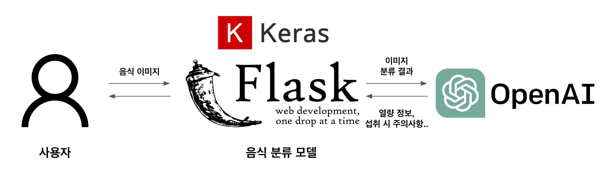

# 렛 미 잇 (Let Me Eat)

## 서비스 배경

- 디지털 헬스케어 산업이 지속적으로 성장하는 추세

- 디지털 헬스케어 분야별 산업이 계속해서 성장함에 따라 생성형 AI ChatGPT 활용 가능성이 증가할 것으로 보임

## 서비스 목적 및 대상

- 다양한 연령층에게 음식 정보 제공 및 해당 음식과 잘 어울리는 추천 서비스 제공

- **모든 연령**에게 ChatGPT API를 활용한 서비스 제공

## 서비스 방식

## 서비스 기대 효과

- 음식에 대한 건강정보 제공 및 추천 음식을 통해 사용자에게 양질의 정보 제공

- **모든 연령층**에게 편리하게 ChatGPT API를 활용하여 서비스 제공

- 현재는 음식 이미지로 제한되어 있지만 의약품을 구분할 수 있는 모델로 확장하는 경우 **의료 산업분야에서 확장성 기대**

## 시연

### PC

### Mobile

